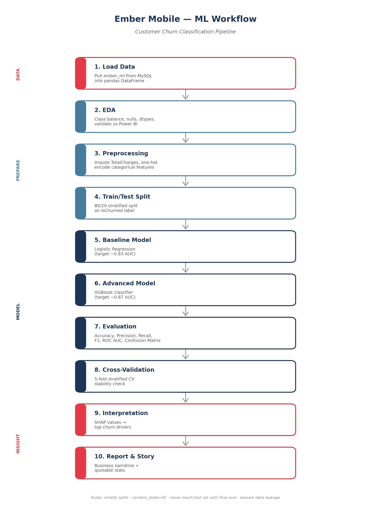

<p align="center">
  
</p>

<h1 align="center">Ember Mobile — Customer Churn Analytics</h1>

<p align="center">
  <em>Diagnosis, prediction and prescriptive intervention across the subscriber base.</em>
</p>

<p align="center">
  
  
  
  
  
  
  
</p>

---

## 1. About This Project

Ember Mobile is a mobile network operator working from a rebranded real-world telecom customer dataset (the underlying data is synthetic, seeded from an anonymised public telecom source and remodelled to represent the Ember Mobile business).

When the engagement began, Ember Mobile had operational customer records only — no analytics layer, no dashboards, no derived metrics, and no view of subscriber health beyond raw billing extracts. This project delivered the analytics stack end-to-end:

- Cleaned and modelled a MySQL data warehouse from the raw CRM extract
- Designed and built the Power BI executive dashboard, including all DAX measures used to derive MRR, ARR, ARPU, churn rate and retention risk
- Trained and deployed a customer churn prediction model with per-customer risk scoring
- Applied natural language sentiment analysis to customer disconnection reasons
- Produced a three-tier retention playbook now guiding the intervention programme

---

## 2. Executive Summary

Ember Mobile's top-line revenue is growing, but the growth is being driven by subscriber volume rather than per-customer value. ARPU is compressing, churn is trending up for the sixth consecutive quarter, and roughly one third of the active base is now flagged at elevated churn risk.

The analytics stack built for this engagement makes the retention problem visible, predictable and actionable — from the KPIs on the executive dashboard down to the recommended intervention for every individual customer.

| Metric | Value |
|---|---|
| Customers in analytical base | ~21,000 |
| Baseline churn rate | 26% |
| Combined at-risk (High + Medium tier) | ~7,500 (36% of base) |
| Departing customers with negative sentiment | 37% |
| Chosen model operating threshold | 0.30 (recall-weighted) |

---

## 3. Business Context

Revenue growth is masking a widening retention gap. MRR is up 17.6% over six quarters, but ARPU has fallen 10.5% and churn rate has risen +4 points over the same period. Every additional point of churn is compounding against the acquisition motion.

This is the tension the analytics stack was commissioned to address: identify who is leaving, why they are leaving, which customers to intervene on, and what treatment each one should receive.

---

## 4. Data Foundation

The analysis draws on the full customer file extracted from the CRM — subscriber demographics, contract terms, service subscriptions, billing history and account lifecycle events — reconciled into a single analytical layer.

**Scope**
- ~21,000 active and lapsed customer records
- Full account lifecycle: signup, contract start and end, last payment, last activity, disconnection date and reason
- 20+ service and billing attributes per customer
- Churn defined operationally from account status and disconnection date — no reliance on a pre-existing label

**Data quality treatment**
- De-duplication of repeated customer records
- Standardisation of categorical values (case, whitespace, spelling variants)
- Out-of-range values flagged and nulled (tenure, charges)
- Missing service and payment attributes imputed as `Unknown` to preserve row-level analytics
- All transformations logged and reproducible

Data generation and preparation scripts:
- [`data/generate_dataset.py`](data/generate_dataset.py) — customer file assembly
- [`data/add_raw_fields.py`](data/add_raw_fields.py) — account lifecycle field derivation

---

## 5. Data Architecture

The warehouse is a star schema in MySQL — two fact tables and four dimensions, one row per customer per table, joined on `customerID`. This structure supports both the BI dashboards and downstream modelling from a single trusted source.

<p align="center">
  
</p>

| Layer | Tables |
|---|---|
| **Facts** | `fact_billing`, `fact_activity` |
| **Dimensions** | `dim_customer`, `dim_account`, `dim_contract`, `dim_services` |

---

## 6. SQL Layer

The SQL layer handles normalisation, cleaning, and view creation for downstream consumers (Power BI and the ML notebooks).

| File | Purpose |
|---|---|
| [`data/Normalisation & Table split.sql`](<data/Normalisation & Table split.sql>) | Splits the flat CRM extract into the star schema; de-duplicates on customer ID; parses dates. |
| [`data/clean star tables.sql`](<data/clean star tables.sql>) | Standardises casing, nulls out-of-range values, imputes `Unknown` for missing categoricals. |
| [`data/Customer Data Join & View.sql`](<data/Customer Data Join & View.sql>) | Creates the analytical view joining all fact and dimension tables. |
| [`data/prepared view for python ML with churned.sql`](<data/prepared view for python ML with churned.sql>) | Derives the `IsChurned` label from `disconnection_date` and produces the ML-ready view. |

---

## 7. Power BI Dashboard

Ember Mobile had no BI capability prior to this engagement. The dashboard was built from the star schema up in Power BI Desktop, with a full set of DAX measures written to derive the retention KPIs the business needed.

**Dashboard pages**
- Executive KPI overview — MRR, ARR, ARPU, churn rate, at-risk customer count
- Segment cuts — churn by Contract, Payment Method, Internet Service and tenure band
- Risk-tier view — customer distribution across High / Medium / Low with stacked recommended actions
- Sentiment view — reason category and sentiment breakdown for departing customers

**Key DAX measures**

```dax
-- Monthly Recurring Revenue
MRR =
CALCULATE (
    SUM ( fact_billing[MonthlyCharges] ),
    dim_account[account_status] IN { "Active", "Suspended" }
)
```

```dax
-- Annualised Recurring Revenue
ARR = [MRR] * 12
```

```dax
-- Average Revenue Per User
ARPU =
DIVIDE (
    [MRR],
    CALCULATE (
        DISTINCTCOUNT ( dim_customer[customerID] ),
        dim_account[account_status] IN { "Active", "Suspended" }
    )
)
```

```dax
-- Churn Rate (%)
Churn Rate =
DIVIDE (
    CALCULATE (
        DISTINCTCOUNT ( dim_customer[customerID] ),
        dim_account[account_status] IN { "Cancelled", "Ported-Out" }
    ),
    DISTINCTCOUNT ( dim_customer[customerID] )
)
```

```dax
-- At-Risk Customer Count (from scored table)
At-Risk Customers =
CALCULATE (
    DISTINCTCOUNT ( ember_scored[customerID] ),
    ember_scored[RiskTier] IN { "High", "Medium" }
)
```

```dax
-- Recovered MRR (from High-tier retention actions)
Recovered MRR =
CALCULATE (
    SUM ( fact_billing[MonthlyCharges] ),
    ember_scored[RiskTier] = "High",
    ember_scored[RetentionOutcome] = "Retained"
)
```

Deliverable: [`Ember Mobile Dash.pbix`](<Ember Mobile Dash.pbix>)

---

## 8. Machine Learning Workflow

A gradient-boosted tree model (XGBoost) scores every customer's likelihood of churn. The workflow moves from a cleaned warehouse view through feature engineering, a baseline logistic regression, the production XGBoost model, threshold tuning, SHAP explainability, and per-customer risk-tier assignment.

<p align="center">
  
</p>

**Pipeline**
1. Pull cleaned customer table from the MySQL warehouse
2. Feature engineering across contract, service, billing and tenure attributes
3. Stratified 80/20 hold-out to preserve churn base rate
4. Baseline logistic regression as a reference
5. Gradient-boosted trees (XGBoost, 300 estimators, depth 5, lr 0.1) as the production model
6. Threshold tuning against precision / recall trade-off
7. Feature-level explainability via SHAP `TreeExplainer`
8. Every customer scored and assigned a risk tier (High / Medium / Low)

Notebook: [`data/ember mobile ml.ipynb`](<data/ember mobile ml.ipynb>)

---

## 9. Model Performance

The threshold sweep across 0.2–0.7 shows F1 peaking in the 0.30–0.40 band. The recommended operating point is **0.30**, chosen to prioritise recall — the cost of missing an at-risk customer materially exceeds the cost of a wasted outreach.

| Threshold | Precision | Recall | F1 |
|:---:|:---:|:---:|:---:|
| 0.20 | 0.51 | 0.92 | 0.66 |
| **0.30** | **0.63** | **0.85** | **0.72** |
| 0.40 | 0.72 | 0.75 | 0.73 |
| 0.50 | 0.80 | 0.63 | 0.70 |
| 0.60 | 0.85 | 0.48 | 0.61 |
| 0.70 | 0.90 | 0.31 | 0.46 |

Threshold is reviewed quarterly against retention programme outcomes.

Deliverables:
- Scored customer file: [`Ember_Churn_Scored.xlsx`](Ember_Churn_Scored.xlsx)
- Persisted model: [`ember_churn_xgb.pkl`](ember_churn_xgb.pkl)

---

## 10. Risk-Tier Segmentation

Every customer is placed into a risk tier based on their predicted churn probability. The tiers drive the retention playbook — treatment intensity scales with tier.

<p align="center">
  
</p>

| Tier | Customers | Share | Programme role |
|---|---:|---:|---|
| **Low** | 13,300 | 64% | Monitor and maintain |
| **High** | 4,600 | 22% | Priority intervention |
| **Medium** | 2,900 | 14% | Automated bundled offer |
| **Combined at-risk** | **~7,500** | **36%** | Active retention book |

Recommended actions are matched to each customer's profile and can be combined — a Medium-risk fibre customer on manual payment may receive an OnlineSecurity bundle, a TechSupport trial and an auto-pay credit as a single stacked treatment.

---

## 11. Sentiment Analysis

A HuggingFace transformer was applied to the free-text disconnection reasons captured in the CRM to distinguish *why* customers leave from *how they feel* about leaving. The distinction matters — an angry leaver needs a relationship reset, a neutral leaver often just needs a better offer.

<p align="center">
  
</p>

**Findings**
- **Service Quality: 100% negative** — every mention is a complaint. This is the highest-priority root cause and the biggest brand-damage risk.
- **Pricing: 33% negative / 67% neutral** — a segmented response. Some customers left for a better deal; a subset are genuinely dissatisfied with value.
- **Life Change / Account Issue: 100% neutral** — structural, largely non-recoverable losses.
- **37% of departing customers left with a negative sentiment** — the headline number for the retention programme.

Notebook: [`data/ember mobile customer sentiment ipynb.ipynb`](<data/ember mobile customer sentiment ipynb.ipynb>)

---

## 12. Recommended Retention Playbook

| Tier | Customers | Treatment | Expected effect |
|---|---:|---|---|
| **High** | 4,600 | Dedicated retention call from account manager · personalised bundle or contract renewal offer · priority ticket routing · 48-hour first-contact SLA | Protect the highest-value revenue at risk of departure |
| **Medium** | 2,900 | Automated bundle offer (OnlineSecurity + TechSupport trial) · credit incentive to migrate to auto-pay · email/SMS nudge sequence · escalate to High if no engagement in 14 days | Efficient, scalable intervention on the mid-risk segment |
| **Low** | 13,300 | Onboarding outreach for customers in first 90 days · loyalty communications · monthly tier-drift monitoring | Maintain relationship and monitor for movement into higher tiers |

---

## 13. Repository Structure

```
Telecom Churn Analysis/
├── branding/
│   └── ember mobile.png                          # Brand logo
├── data/
│   ├── generate_dataset.py                       # Customer file assembly
│   ├── add_raw_fields.py                         # Account lifecycle fields
│   ├── Normalisation & Table split.sql           # Star schema build
│   ├── clean star tables.sql                     # Data quality treatment
│   ├── Customer Data Join & View.sql             # Analytical view
│   ├── prepared view for python ML with churned.sql   # ML-ready view + IsChurned label
│   ├── ember mobile ml.ipynb                     # XGBoost + SHAP + risk tiers
│   └── ember mobile customer sentiment ipynb.ipynb    # HuggingFace sentiment
├── Ember Mobile Dash.pbix                        # Power BI dashboard
├── Ember_Churn_Scored.xlsx                       # Scored customer file
├── ember_churn_xgb.pkl                           # Persisted model
├── Ember_Mobile_Churn_Deck.pptx                  # Executive slide deck
├── ML_Workflow_Flowchart.png                     # Modelling workflow diagram
├── ML_Workflow_Playbook.docx                     # ML process reference
├── Power BI star Schema from source.png          # Warehouse diagram
├── risk tier churn BI.png                        # Risk-tier dashboard page
├── sentiment analysis python.png                 # Sentiment dashboard page
└── README.md
```

---

## 14. How to Reproduce

**Prerequisites**
- Python 3.10+ with `pandas`, `numpy`, `scikit-learn`, `xgboost`, `shap`, `transformers`, `torch`
- MySQL 8+
- Power BI Desktop (latest)

**Order of operations**
1. Run `data/generate_dataset.py` then `data/add_raw_fields.py` to produce the raw CRM extract
2. Load the extract into a MySQL schema named `embermobile`
3. Execute the SQL files in order: `Normalisation & Table split.sql` → `clean star tables.sql` → `Customer Data Join & View.sql` → `prepared view for python ML with churned.sql`
4. Run `data/ember mobile ml.ipynb` to train the model and produce the scored customer file
5. Run `data/ember mobile customer sentiment ipynb.ipynb` for the sentiment layer
6. Open `Ember Mobile Dash.pbix` to view the dashboard against the populated warehouse

---

## 15. Deliverables

| Artefact | File |
|---|---|
| Executive slide deck | [`Ember_Mobile_Churn_Deck.pptx`](Ember_Mobile_Churn_Deck.pptx) |
| Power BI dashboard | [`Ember Mobile Dash.pbix`](<Ember Mobile Dash.pbix>) |
| Scored customer file | [`Ember_Churn_Scored.xlsx`](Ember_Churn_Scored.xlsx) |
| Persisted model | [`ember_churn_xgb.pkl`](ember_churn_xgb.pkl) |
| ML process reference | [`ML_Workflow_Playbook.docx`](ML_Workflow_Playbook.docx) |

---

## 16. Author

**Joseph Kennedy** — Data Analyst

End-to-end delivery: data engineering, warehousing (MySQL), BI dashboarding (Power BI / DAX), predictive modelling (XGBoost, SHAP), NLP (HuggingFace transformers), and stakeholder communication.

<sub>Underlying dataset is synthetic, seeded from an anonymised public telecom customer source and remodelled to represent the Ember Mobile business.</sub>
